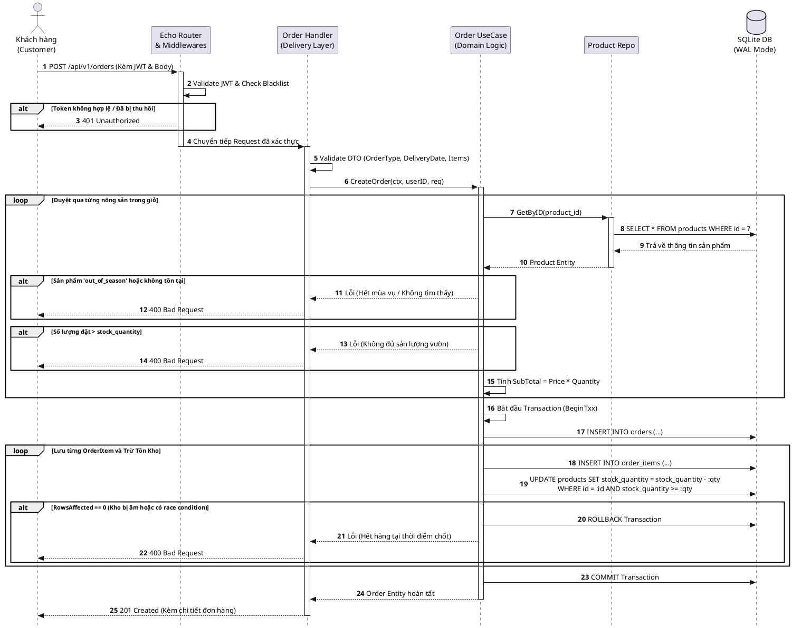
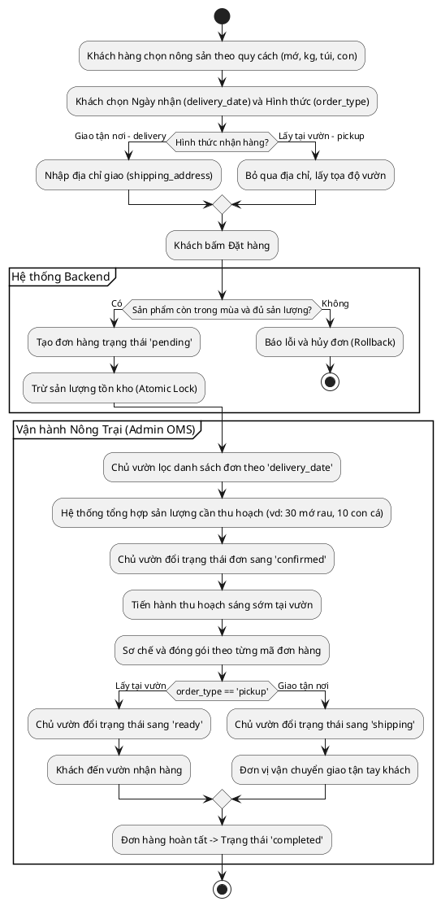

# Konekuto OMS (Farm-to-Table Order Management System) 🥦🐟

Hệ thống quản lý đơn hàng backend cho mô hình nông sản tự trồng ("Từ vườn đến bàn ăn"), xây dựng bằng **Golang** theo chuẩn **Clean Architecture** và nguyên lý **SOLID** (100% Dependency Inversion qua Interfaces).

## 🛠 Tech Stack
- **Ngôn ngữ:** Golang 1.27
- **Web Framework:** Echo v5
- **Database:** SQLite (WAL mode) + `sqlx`
- **Security:** 
  - JWT Authentication (Access Token 15 phút & Refresh Token 7 ngày lưu DB).
  - RBAC (Role-Based Access Control) phân quyền `admin` / `customer`.
  - Token Blacklist thu hồi token khi logout kèm Background Worker dọn rác định kỳ.
- **Validation:** `go-playground/validator/v10`

---

## 🌾 Đặc thù Nghiệp vụ Nông sản (Farm-to-Table Domain)

- **Đơn vị tính linh hoạt (`unit`):** Bán theo quy cách cố định (`mớ`, `kg`, `túi 500g`, `con`) để đảm bảo số lượng (`quantity`) luôn là số nguyên, tránh sai số dấu phẩy động.
- **Quản lý vụ mùa (`status`):** Phân biệt trạng thái `active` (đang thu hoạch) và `out_of_season` (hết mùa/chờ lứa mới).
- **Gom đơn theo đợt (`delivery_date`):** Hỗ trợ chọn ngày giao để chủ vườn tổng hợp sản lượng và thu hoạch tươi trong ngày.
- **Hình thức nhận hàng (`order_type`):**
  - `pickup`: Nhận trực tiếp tại vườn (không bắt buộc địa chỉ giao).
  - `delivery`: Giao tận nơi (bắt buộc `shipping_address`).
- **Chống bán lố (Zero Overselling):** Sử dụng câu lệnh Atomic Update trực tiếp trong Database Transaction:
  ```sql
  UPDATE products 
  SET stock_quantity = stock_quantity - :quantity 
  WHERE id = :product_id AND stock_quantity >= :quantity AND deleted_at IS NULL

---

## 📊 Sơ đồ Nghiệp vụ (PlantUML Business Workflows)

### 1. Luồng Đặt Hàng & Xử Lý Giao Dịch (Order Checkout Flow)
Sơ đồ minh họa luồng xử lý Transaction khép kín qua các tầng Clean Architecture, bảo vệ tính toàn vẹn dữ liệu và cơ chế **Atomic Update** ngăn chặn bán vượt sản lượng.



---

### 2. Chu Trình Gom Đơn & Thu Hoạch (Farm-to-Table Lifecycle)
Sơ đồ hoạt động thể hiện vòng đời gom đơn theo ngày giao (`delivery_date`), phân loại hình thức nhận hàng (`pickup` / `delivery`) và quy trình thu hoạch tươi sống.



---

## 🏗 Kiến trúc Hệ thống (Clean Architecture Flow)

Dự án được chia thành các Layer (Tầng) độc lập. Các tầng giao tiếp với nhau **hoàn toàn thông qua Interfaces**, giúp mã nguồn dễ dàng viết Unit Test và dễ dàng thay đổi công nghệ (VD: Đổi SQLite sang PostgreSQL mà không cần sửa Core Logic).

**Luồng đi của một Request (API Flow):**
1. **Client** gửi HTTP Request (JSON).
2. **Server / Middleware:** Bắt Request, kiểm tra CORS, Rate Limit, ghi Log, và xác thực JWT (nếu API bị khóa).
3. **Delivery (Handler):** Nhận Request, parse JSON, Validate dữ liệu đầu vào.
4. **UseCase (Domain Logic):** Nhận DTO từ Handler, xử lý nghiệp vụ lõi (tính toán, cấp UUID, kiểm tra điều kiện).
5. **Repository:** Được UseCase gọi để lưu/lấy dữ liệu. Trực tiếp thực thi câu lệnh SQL với Database.
6. Kết quả đi ngược từ dưới lên và trả về Client (chuẩn JSON Response).

---

## 📂 Cấu trúc Thư mục (Directory Structure)

```text
konekuto-oms/
├── cmd/
│   └── api/
│       └── main.go              # Điểm khởi chạy của ứng dụng (Entry point)
├── configs/
│   └── config.local.yaml        # File cấu hình (Port, DB, Secret - Được Ignore)
├── internal/
│   ├── config/                  # Load cấu hình bằng Viper
│   ├── domain/                  # Lõi hệ thống: Entities, DTOs, Interfaces
│   ├── server/                  # Quản lý vòng đời Server & Dependency Injection
│   ├── product/                 # Module Sản phẩm (Handler, UseCase, Repository)
│   └── user/                    # Module Người dùng (Handler, UseCase, Repository)
├── pkg/
│   ├── middlewares/             # Các Middleware tự viết (Auth, RBAC, Blacklist)
│   ├── response/                # Chuẩn hóa JSON Response trả về Client
│   └── validations/             # Cấu hình Validator
├── scripts/
│   └── init.sql                 # Script tạo DB Schema ban đầu
├── .gitignore
├── go.mod
└── README.md