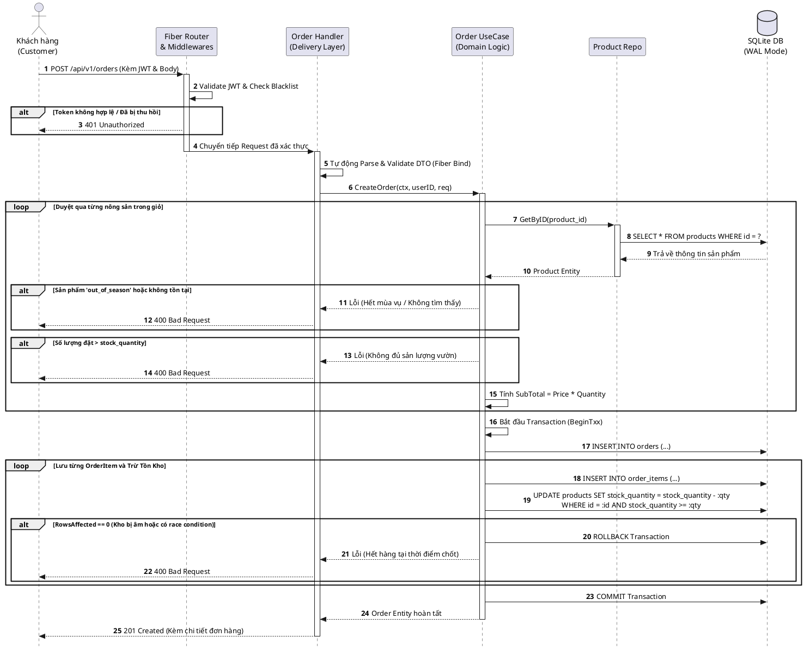
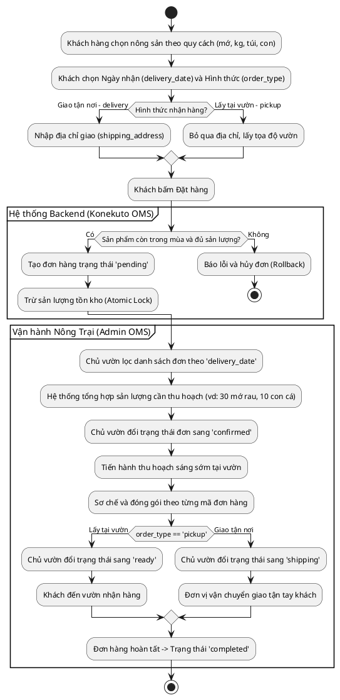

# Konekuto OMS (Farm-to-Table Order Management System) 🥦🐟

Hệ thống quản lý đơn hàng backend chuyên biệt cho mô hình nông sản tự trồng ("Từ vườn đến bàn ăn"). Dự án được xây dựng bằng **Golang** theo chuẩn **Clean Architecture** và nguyên lý **SOLID** (100% Dependency Inversion qua Interfaces), đảm bảo tính mở rộng và dễ dàng bảo trì.

## 🛠 Tech Stack & Nền tảng
- **Ngôn ngữ:** Golang 1.27
- **Web Framework:** Fiber v3 *(Hiệu năng cao, tích hợp Graceful Shutdown & Prefork)*
- **Database:** SQLite (WAL mode) + `sqlx`
- **Tối ưu hóa (Performance):** Sử dụng `goccy/go-json` thay thế chuẩn JSON mặc định giúp tăng tốc độ parse/serialize.
- **Bảo mật (Security):** 
  - JWT Authentication (Access Token 15 phút & Refresh Token 7 ngày lưu DB).
  - RBAC (Role-Based Access Control) phân quyền `admin` / `customer`.
  - Token Blacklist: Thu hồi token tức thì khi logout, kết hợp Background Worker dọn rác định kỳ.
- **Validation:** `go-playground/validator/v10` (Tích hợp Unified Binding của Fiber).

---

## 🌾 Đặc thù Nghiệp vụ Nông sản (Farm-to-Table Domain)

- **Đơn vị tính linh hoạt (`unit`):** Bán theo quy cách cố định (`mớ`, `kg`, `túi 500g`, `con`) nhằm đảm bảo số lượng (`quantity`) luôn là số nguyên, triệt tiêu sai số dấu phẩy động.
- **Quản lý vụ mùa (`status`):** Phân biệt rõ trạng thái `active` (đang thu hoạch) và `out_of_season` (hết mùa/chờ lứa mới).
- **Gom đơn theo đợt (`delivery_date`):** Hỗ trợ khách hàng chọn ngày giao để chủ vườn tổng hợp sản lượng và thu hoạch tươi sống trong ngày.
- **Hình thức nhận hàng (`order_type`):**
  - `pickup`: Nhận trực tiếp tại vườn (Không yêu cầu địa chỉ).
  - `delivery`: Giao tận nơi (Bắt buộc phải có `shipping_address`).
- **Chống bán lố (Zero Overselling):** Sử dụng cơ chế khóa mức cơ sở dữ liệu (Atomic Update) trực tiếp trong Database Transaction:
  ```sql
  UPDATE products 
  SET stock_quantity = stock_quantity - :quantity 
  WHERE id = :product_id AND stock_quantity >= :quantity AND deleted_at IS NULL

---

## 📊 Sơ đồ Nghiệp vụ (PlantUML Business Workflows)

### 1. Luồng Đặt Hàng & Xử Lý Giao Dịch (Order Checkout Flow)
Sơ đồ minh họa luồng xử lý Transaction khép kín qua các tầng Clean Architecture, bảo vệ tính toàn vẹn dữ liệu và cơ chế Atomic Update ngăn chặn bán vượt sản lượng thực tế tại vườn.


```plantuml
@startuml
autonumber
skinparam style strictuml
skinparam SequenceMessageAlignment center

actor "Khách hàng\n(Customer)" as Client
participant "Fiber Router\n& Middlewares" as Middleware
participant "Order Handler\n(Delivery Layer)" as Handler
participant "Order UseCase\n(Domain Logic)" as UseCase
participant "Product Repo" as ProductRepo
database "SQLite DB\n(WAL Mode)" as DB

Client -> Middleware: POST /api/v1/orders (Kèm JWT & Body)
activate Middleware
Middleware -> Middleware: Validate JWT & Check Blacklist
alt Token không hợp lệ / Đã bị thu hồi
    Middleware --> Client: 401 Unauthorized
end
Middleware -> Handler: Chuyển tiếp Request đã xác thực
deactivate Middleware

activate Handler
Handler -> Handler: Tự động Parse & Validate DTO (Fiber Bind)
Handler -> UseCase: CreateOrder(ctx, userID, req)
activate UseCase

loop Duyệt qua từng nông sản trong giỏ
    UseCase -> ProductRepo: GetByID(product_id)
    activate ProductRepo
    ProductRepo -> DB: SELECT * FROM products WHERE id = ?
    DB --> ProductRepo: Trả về thông tin sản phẩm
    ProductRepo --> UseCase: Product Entity
    deactivate ProductRepo

    alt Sản phẩm 'out_of_season' hoặc không tồn tại
        UseCase --> Handler: Lỗi (Hết mùa vụ / Không tìm thấy)
        Handler --> Client: 400 Bad Request
    end
    alt Số lượng đặt > stock_quantity
        UseCase --> Handler: Lỗi (Không đủ sản lượng vườn)
        Handler --> Client: 400 Bad Request
    end
    UseCase -> UseCase: Tính SubTotal = Price * Quantity
end

UseCase -> UseCase: Bắt đầu Transaction (BeginTxx)
UseCase -> DB: INSERT INTO orders (...)
loop Lưu từng OrderItem và Trừ Tồn Kho
    UseCase -> DB: INSERT INTO order_items (...)
    UseCase -> DB: UPDATE products SET stock_quantity = stock_quantity - :qty\nWHERE id = :id AND stock_quantity >= :qty
    alt RowsAffected == 0 (Kho bị âm hoặc có race condition)
        UseCase -> DB: ROLLBACK Transaction
        UseCase --> Handler: Lỗi (Hết hàng tại thời điểm chốt)
        Handler --> Client: 400 Bad Request
    end
end
UseCase -> DB: COMMIT Transaction
UseCase --> Handler: Order Entity hoàn tất
deactivate UseCase

Handler --> Client: 201 Created (Kèm chi tiết đơn hàng)
deactivate Handler
@enduml
```

---

### 2. Chu Trình Gom Đơn & Thu Hoạch (Farm-to-Table Lifecycle)
Sơ đồ thể hiện vòng đời đơn hàng theo ngày giao (delivery_date), luồng rẽ nhánh hình thức nhận hàng (pickup / delivery) và quy trình vận hành thu hoạch tươi sống tại trang trại.


```plantuml
@startuml
start

:Khách hàng chọn nông sản theo quy cách (mớ, kg, túi, con);
:Khách chọn Ngày nhận (delivery_date) và Hình thức (order_type);

if (Hình thức nhận hàng?) then (Giao tận nơi - delivery)
  :Nhập địa chỉ giao (shipping_address);
else (Lấy tại vườn - pickup)
  :Bỏ qua địa chỉ, lấy tọa độ vườn;
endif

:Khách bấm Đặt hàng;

partition "Hệ thống Backend (Konekuto OMS)" {
  if (Sản phẩm còn trong mùa và đủ sản lượng?) then (Có)
    :Tạo đơn hàng trạng thái 'pending';
    :Trừ sản lượng tồn kho (Atomic Lock);
  else (Không)
    :Báo lỗi và hủy đơn (Rollback);
    stop
  endif
}

partition "Vận hành Nông Trại (Admin OMS)" {
  :Chủ vườn lọc danh sách đơn theo 'delivery_date';
  :Hệ thống tổng hợp sản lượng cần thu hoạch (vd: 30 mớ rau, 10 con cá);
  :Chủ vườn đổi trạng thái đơn sang 'confirmed';
  
  :Tiến hành thu hoạch sáng sớm tại vườn;
  :Sơ chế và đóng gói theo từng mã đơn hàng;
  
  if (order_type == 'pickup') then (Lấy tại vườn)
    :Chủ vườn đổi trạng thái sang 'ready';
    :Khách đến vườn nhận hàng;
  else (Giao tận nơi)
    :Chủ vườn đổi trạng thái sang 'shipping';
    :Đơn vị vận chuyển giao tận tay khách;
  endif
  
  :Đơn hàng hoàn tất -> Trạng thái 'completed';
}

stop
@enduml
```

---

## 🏗 Kiến trúc Hệ thống (Clean Architecture Flow)

Dự án được phân rã thành các Layer (Tầng) độc lập. Các tầng giao tiếp với nhau hoàn toàn thông qua Interfaces, giúp mã nguồn dễ viết Unit Test và có thể thay đổi công nghệ (VD: Chuyển DB từ SQLite sang PostgreSQL) mà không làm vỡ Core Logic.

**Luồng đi của một Request (API Flow):**
1. **Client** gửi HTTP Request (JSON).
2. **Fiber Router & Middleware** Bắt Request, kiểm tra CORS, Rate Limit, ghi Log an toàn, và giải mã JWT.
3. **Delivery (Handler):** Nhận Request, parse JSON và Validate dữ liệu tự động qua Fiber BodyParser.
4. **UseCase (Domain Logic):** Nhận DTO từ Handler, xử lý nghiệp vụ lõi (tính toán, cấp UUID, xác thực điều kiện nông sản).
5. **Repository:** Được UseCase gọi để tương tác. Trực tiếp thực thi câu lệnh SQL với Database.
6. Kết quả trả ngược từ dưới lên thông qua Interface và xuất ra Client dưới chuẩn JSON Response.

---

## 📂 Cấu trúc Thư mục (Directory Structure)

```text
konekuto-oms/
├── cmd/
│   └── api/
│       └── main.go              # Điểm khởi chạy của ứng dụng, cấu hình Graceful Shutdown
├── configs/
│   └── config.local.yaml        # File cấu hình (Port, DB, Secret - Được Ignore)
├── internal/
│   ├── config/                  # Module Load cấu hình
│   ├── domain/                  # Lõi hệ thống: Entities, DTOs, Interfaces
│   ├── server/                  # Quản lý vòng đời Server (Fiber App) & Dependency Injection
│   ├── product/                 # Module Nông sản (Handler, UseCase, Repository)
│   ├── order/                   # Module Đơn hàng (Handler, UseCase, Repository)
│   └── user/                    # Module Người dùng & Auth (Handler, UseCase, Repository)
├── pkg/
│   ├── middlewares/             # Các Middleware tự viết (Auth, RBAC, Blacklist)
│   ├── response/                # Cấu trúc chuẩn hóa JSON Response trả về Client
│   └── validations/             # Cấu hình Validator cho DTO
├── scripts/
│   └── init.sql                 # Script tạo Database Schema ban đầu
├── .gitignore
├── go.mod
└── README.md